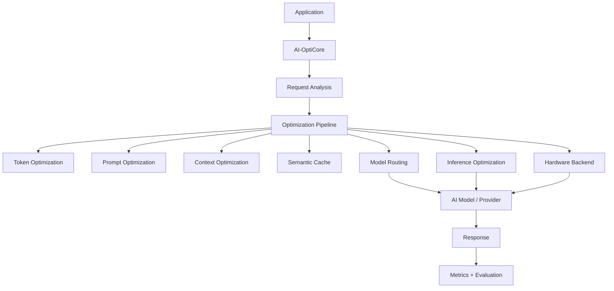

# AI-OptiCore

> An open-source optimization layer for AI/LLM applications that reduces unnecessary token usage, latency, memory consumption, and inference cost while preserving response quality.

AI-OptiCore sits between your AI application and your model provider. It analyzes every request and passes it through a modular **optimization pipeline** (token analysis, prompt optimization, context management, semantic cache, model routing, inference optimization, hardware backends) before the request reaches the model — then measures and evaluates the result.

It is built from day one for open-source collaboration: every optimizer, provider, and hardware backend is a pluggable component with clear interfaces, tests, and documentation.

---

## Problem statement

LLM applications waste tokens, time, and money on:

- redundant prompt text and duplicated instructions,
- bloated conversational context,

- repeated identical or near-identical requests,
- oversized models handling trivial requests,
- latent device capability that goes unused.

Most apps have **no visibility** into how much of their spend is waste. AI-OptiCore gives you a measurable optimization layer that you can turn on, tune, benchmark, and evaluate — without rewriting your application.

## Why AI-OptiCore exists

- **Measured, not claimed.** Every optimization is real, tested, and benchmarkable. We never fabricate results.
- **Modular.** Add an optimizer, a provider, or a hardware backend without touching the core.
- **Safe.** Different safety modes (SAFE / BALANCED / AGGRESSIVE) control how aggressive transformations are; quality gates warn when aggressive optimization may affect output.
- **Provider-agnostic.** OpenAI-compatible APIs, Ollama, and local Hugging Face models all implement one provider interface.
- **AMD-ready.** ROCm support is designed as an independent, testable backend from day one — no vendor lock-in.

## Architecture



Optimizers are sequential, independent components:


## Features

| Area | Description |
| --- | --- |
| Token analysis | Real tokenizer implementations (`tiktoken`), per-component token counts, reduction % |
| Prompt optimization | Removes obvious redundancy (repeated instructions, whitespace, duplicate context) with configurable safety modes |
| Context optimization | Token budgets, recent/relevance prioritization, duplicate removal; never mutates your data |
| Semantic cache | Exact + embedding similarity, configurable threshold, TTL, invalidation, metadata, hit/miss metrics |
| Model routing | Complexity/budget/cost-based selection; disable fully when you don't want it |
| Hardware abstraction | CPU / CUDA / ROCm backends with honest capability detection |
| Inference optimization | Interfaces for batching, quantization, loading, memory tracking (experimental/planned statuses are explicit) |
| Benchmarking | Real measurements, baseline vs optimized, `ai-opticore benchmark` |
| Evaluation | Request/response similarity, quality gates, pluggable evaluators |
| Metrics | Unified `MetricsCollector` that is extensible |
| CLI | `init`, `optimize`, `benchmark`, `cache`, `models`, `hardware`, `config` |
| Dashboard | Lightweight React dashboard (see `dashboard/`) |

## Installation

Requires **Python 3.11+**.

```bash
git clone https://github.com/ai-opticore/ai-opticore.git
cd ai-opticore
python -m venv .venv && source .venv/bin/activate
pip install -e ".[all]"
```

Minimum install (core, no provider SDKs):

```bash
pip install -e .
```

Optional feature extras:

```bash
pip install -e ".[openai]"      # OpenAI-compatible APIs
pip install -e ".[ollama]"      # local Ollama models
pip install -e ".[huggingface]" # local Hugging Face models
pip install -e ".[semantic]"    # sentence-transformers embeddings
pip install -e ".[benchmark]"   # psutil, numpy for benchmarks
pip install -e ".[dev]"         # pytest, ruff, mypy
```

Set your API key in the environment (never commit keys):

```bash
cp .env.example .env
# edit .env, then:
set -a && source .env && set +a
```

## Quick start

Optimize a prompt without calling any model:

```python
from opticore import Optimizer

optimizer = Optimizer()

result = optimizer.optimize(
    prompt="Can you please tell me what is   machine learning?",
    system="You are a helpful assistant.",
)

print(result.optimized_prompt)   # cleaned prompt
print(result.tokens_saved)       # real tokens saved
print(result.reduction_percent)
```

Optimize and generate through your provider:

```python
from opticore import AIClient

client = AIClient(
    provider="openai",           # or "ollama", "huggingface", or any BaseProvider
    optimization=True,
)

response = client.generate(prompt="Explain caching in LLM applications.")
print(response.content)
print(response.tokens_saved)
print(response.cache_hit)
```

Turn optimization off for a baseline comparison:

```python
baseline_client = AIClient(provider="openai", optimization=False)
```

## Benchmarking

```bash
ai-opticore benchmark                    # uses fake provider; safe for CI
ai-opticore benchmark --provider openai  # real provider (needs OPENAI_API_KEY)
ai-opticore benchmark --provider ollama
ai-opticore benchmark --samples 10 --repeats 3
```

Output contains **real measured values** (or `N/A` when a metric cannot be measured):

```text
AI-OptiCore Benchmark
--------------------

Model: ...
Provider: ...
Hardware: ...

Baseline
Input tokens: ...
Output tokens: ...
Latency: ...

Optimized
Input tokens: ...
Output tokens: ...
Latency: ...

Token reduction: ...
Latency change: ...
Cache hit rate: ...
```

> AI-OptiCore provides tools for measuring and reducing unnecessary token usage. We do not publish fixed reduction claims — run your own benchmarks on your own workloads.

## Supported providers

Register an existing provider or add your own.

| Provider | Module | Notes |
| --- | --- | --- |
| OpenAI-compatible | `providers.openai` | Also Azure/vLLM/llama.cpp server via `base_url` |
| Ollama | `providers.ollama` | Local REST API |
| Hugging Face (local) | `providers.huggingface` | `transformers` |

## Hardware support

- **CPU** — always available.
- **CUDA** — detected via PyTorch.
- **ROCm / AMD** — detected via `torch.version.hip` + device vendor. Status: experimental. See [`docs/hardware/rocm.md`](docs/hardware/rocm.md) for tested configurations and known limitations.

Detection never fakes results. If a backend is unavailable, a clear capability message is returned.

## Roadmap

- [ ] v0.2 — Redis/disk cache backends
- [ ] v0.2 — Prompt templates and instruction-preserving rewrites
- [ ] v0.3 — Real batched inference executor
- [ ] v0.3 — Automated regression suite over provider SDKs
- [ ] v0.4 — Dashboard with live metrics (see `dashboard/`)
- [ ] v0.4 — ONNX Runtime hardware backends

## Contributing

See [CONTRIBUTING.md](CONTRIBUTING.md). All contributions are welcome: optimizers, providers, hardware backends, benchmarks, docs, bug fixes.

## License

MIT — see [LICENSE](LICENSE).