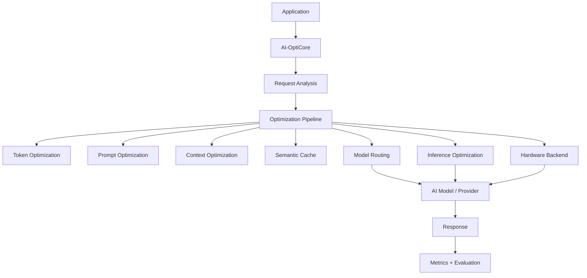
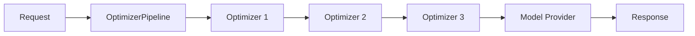

# AI-OptiCore

> An open-source optimization layer for AI/LLM applications that reduces unnecessary token usage, latency, memory consumption, and inference cost while preserving response quality.

AI-OptiCore sits between your AI application and your model provider. It analyzes every request and passes it through a modular **optimization pipeline** (token analysis, prompt optimization, context management, semantic cache, model routing, inference optimization, hardware backends) before the request reaches the model — then measures and evaluates the result.

It is built from day one for open-source collaboration: every optimizer, provider, and hardware backend is a pluggable component with clear interfaces, tests, and documentation.

---

## Problem statement

LLM applications waste tokens, time, and money on:

- redundant prompt text and duplicated instructions,
- bloated conversational context,

- repeated identical or near-identical requests,
- oversized models handling trivial requests,
- latent device capability that goes unused.

Most apps have **no visibility** into how much of their spend is waste. AI-OptiCore gives you a measurable optimization layer that you can turn on, tune, benchmark, and evaluate — without rewriting your application.

## Why AI-OptiCore exists

- **Measured, not claimed.** Every optimization is real, tested, and benchmarkable. We never fabricate results.
- **Modular.** Add an optimizer, a provider, or a hardware backend without touching the core.
- **Safe.** Different safety modes (SAFE / BALANCED / AGGRESSIVE) control how aggressive transformations are; a quality gate evaluates each optimized request against the original (prompt + conversation history) and falls back to the original on failure.
- **Provider-agnostic.** OpenAI-compatible APIs, Ollama, and local Hugging Face models all implement one provider interface.
- **AMD-ready.** ROCm support is designed as an independent, testable backend from day one — no vendor lock-in.
- **Honest.** Benchmarking reports real measured values including optimizer overhead and cache hit rate — or `N/A` when a metric cannot be measured. Never fabricated.

## Architecture



Optimizers are sequential, independent components:



## Features

| Area | Description |
| --- | --- |
| Token analysis | Real tokenizer implementations (`tiktoken`), per-component token counts, reduction % |
| Prompt optimization | Removes obvious redundancy (repeated instructions, whitespace, duplicate context) with configurable safety modes |
| Context optimization | Token budgets, recent-message priority (not true relevance), duplicate removal; never mutates your data |
| Semantic cache | Exact + embedding similarity, configurable threshold, TTL, invalidation, metadata, model/provider/namespace isolation, hit/miss metrics; bounded memory or SQLite disk backend |
| Model routing | Complexity/budget-based selection with availability validation + fallback; disable fully when you don't want it |
| Hardware abstraction | CPU / CUDA / ROCm backends with honest capability detection |
| Inference optimization | Interfaces for batching, quantization, loading, memory tracking (experimental/planned statuses are explicit) |
| Benchmarking | Real measurements, baseline vs optimized, median/p95, net latency change, per-scenario breakdown, `ai-opticore benchmark` |
| Cost | Optional user-configured pricing; costs are always labeled `estimated` and `N/A` when unconfigured |
| Evaluation | Request/response similarity, quality gates, pluggable evaluators; rejection restores the original request |
| Metrics | Unified `MetricsCollector` that is extensible |
| CLI | `init`, `optimize`, `benchmark`, `cache`, `models`, `hardware`, `config` |
| Dashboard | Lightweight React dashboard (see `dashboard/`) |

## Installation

Requires **Python 3.9+**.

```bash
git clone https://github.com/MugdhaSontakke/ai-opticore.git
cd ai-opticore
python -m venv .venv && source .venv/bin/activate
pip install -e ".[all]"
```

Minimum install (core, no provider SDKs):

```bash
pip install -e .
```

Optional feature extras:

```bash
pip install -e ".[openai]"      # OpenAI-compatible APIs
pip install -e ".[ollama]"      # local Ollama models
pip install -e ".[huggingface]" # local Hugging Face models
pip install -e ".[semantic]"    # sentence-transformers embeddings
pip install -e ".[yaml]"        # YAML config file support
pip install -e ".[benchmark]"   # psutil, numpy for benchmarks
pip install -e ".[dev]"         # pytest, hypothesis, ruff, mypy, pyyaml
```

Set your API key in the environment (never commit keys):

```bash
cp .env.example .env
# edit .env, then:
set -a && source .env && set +a
```

## Quick start

Optimize a prompt without calling any model:

```python
from opticore import Optimizer

optimizer = Optimizer()

result = optimizer.optimize(
    prompt="Can you please tell me what is   machine learning?",
    system="You are a helpful assistant.",
)

print(result.optimized_prompt)   # cleaned prompt
print(result.tokens_saved)       # real tokens saved
print(result.reduction_percent)
```

Optimize and generate through your provider:

```python
from opticore import AIClient

client = AIClient(
    provider="openai",           # or "ollama", "huggingface", or any BaseProvider
    optimization=True,
)

response = client.generate(prompt="Explain caching in LLM applications.")
print(response.content)
print(response.tokens_saved)
print(response.cache_hit)
print(response.request_id)       # per-request observability
print(response.metadata["routing"])   # when a ModelRouter is attached
print(response.estimated_cost)   # only populated when pricing is configured
```

Turn optimization off for a baseline comparison:

```python
baseline_client = AIClient(provider="openai", optimization=False)
```

Optional disk cache (survives process restarts; SQLite, stdlib-only):

```python
client = AIClient(
    provider="ollama",
    config=OptimizationConfig(cache_backend="disk", cache_disk_path="/var/cache/opticore.sqlite"),
)
```

## Benchmarking

```bash
ai-opticore benchmark                    # uses fake provider; safe for CI
ai-opticore benchmark --provider openai  # real provider (needs OPENAI_API_KEY)
ai-opticore benchmark --provider ollama
ai-opticore benchmark --samples 10 --repeats 3
```

Output contains **real measured values** (or `N/A` when a metric cannot be measured). It reports
baseline vs optimized tokens and latency, median and p95 latency, the net latency
change (including when optimization makes a workload *slower*), optimizer overhead vs
provider latency split, cache hit rate, per-scenario breakdowns, and estimated cost
only when you configure pricing:

```yaml
# opticore.yaml
pricing:
  input_per_1k: 0.005   # USD per 1k input tokens (example, user-supplied)
  output_per_1k: 0.015
```

> Cost figures are always labeled `estimated` — AI-OptiCore never bakes in vendor
> prices that can go stale, and never reports a cost figure when pricing is not
> configured.

> AI-OptiCore provides tools for measuring and reducing unnecessary token usage. We do not publish fixed reduction claims — run your own benchmarks on your own workloads.

## Provider regression testing

```bash
# Run real-endpoint regression tests (optional/opt-in; skips cleanly in CI):
OPTICORE_TEST_LIVE=1 \
OPTICORE_TEST_OPENAI_API_KEY=sk-... \
pytest -q tests/test_providers_live.py
```

See `tests/test_providers_live.py` for all supported variables (OpenAI-compatible,
Ollama), plus the manual `provider-live` GitHub workflow.

## Supported providers

Register an existing provider or add your own.

| Provider | Module | Notes |
| --- | --- | --- |
| OpenAI-compatible | `providers.openai` | Also Azure/vLLM/llama.cpp server via `base_url` |
| Ollama | `providers.ollama` | Local REST API |
| Hugging Face (local) | `providers.huggingface` | `transformers` |

## Hardware support

- **CPU** — always available.
- **CUDA** — detected via PyTorch.
- **ROCm / AMD** — detected via `torch.version.hip` + device vendor. Status: experimental. See [`docs/hardware/rocm.md`](docs/hardware/rocm.md) for tested configurations and known limitations.

Detection never fakes results. If a backend is unavailable, a clear capability message is returned.

## Roadmap

- [x] Initial hardening toward v0.1 (quality gate with safe fallback, overhead measurement, cache isolation, secret-safe logging)
- [x] v0.1 hardening pass 2 (real provider analytics, per-step timing, honest timing/caching, `ai-opticore` exit codes)
- [x] v0.1.0 — Disk cache backend (SQLite), estimated-cost accounting, per-scenario benchmarks, provider regression test framework, observability (request IDs, routing/quality/fallback metadata), dashboard REAL-vs-DEMO labeling
- [x] v0.2.0 — SSRF guardrails (`validate_base_url`), provider retry policy with typed error mapping, request redaction, config `validate`, cache `stats`, benchmark `--dataset`, dashboard DATA UNAVAILABLE state + median/p95/overhead/cost rendering, Docker (non-root image, compose with optional Ollama), `docs/api_stability.md`
- [ ] v0.2 — Live-provider matrix validated per release; mock-based unit tests for provider SDK request/error paths
- [ ] v0.3 — Redis cache backend; real batched inference executor
- [ ] v0.3 — Response-level quality gate with a judge/similarity model (optional path)
- [ ] v0.4 — Dashboard with live metrics (see `dashboard/`)
- [ ] v0.4 — ONNX Runtime hardware backends

Full plan: [`docs/next_roadmap.md`](docs/next_roadmap.md) · Scorecard:
[`docs/production_checklist.md`](docs/production_checklist.md) · Matrix:
[`docs/production_readiness.md`](docs/production_readiness.md)

## Contributing

See [CONTRIBUTING.md](CONTRIBUTING.md). All contributions are welcome: optimizers, providers, hardware backends, benchmarks, docs, bug fixes.

## License

MIT — see [LICENSE](LICENSE).